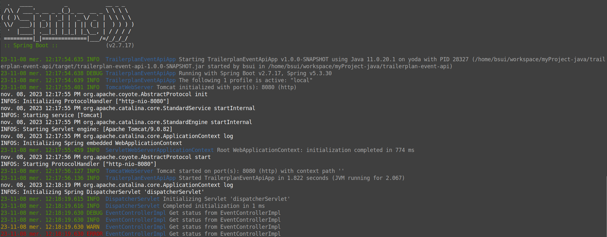
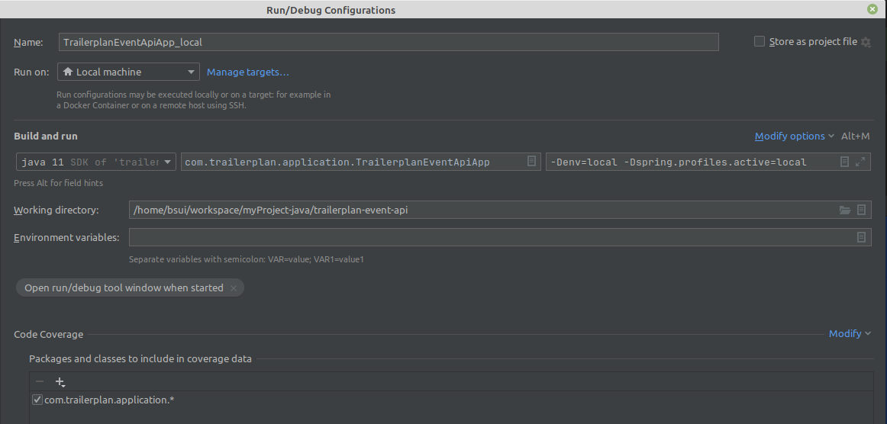
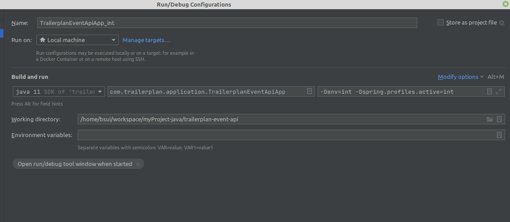
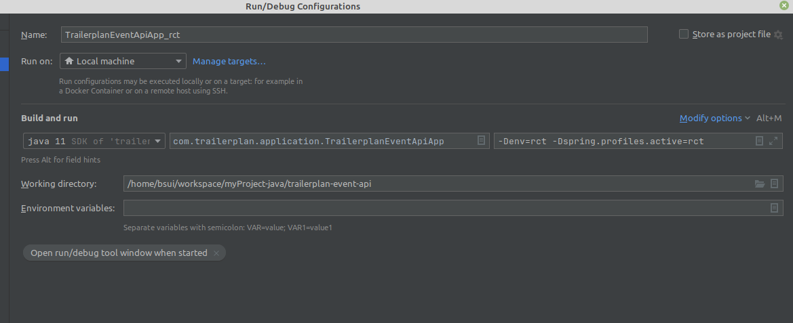

[](https://openjdk.org/projects/jdk/11/)
[](https://docs.spring.io/spring-boot/docs/2.7.17.RELEASE/reference/html/)
[](https://www.docker.com)
[](https://github.com/spotify/dockerfile-maven)
[](https://docs.docker.com/compose/)
[](https://logback.qos.ch/)
[](https://linuxmint.com/)


# Multiple environment in container docker

This project is a simple project spring boot to show a building docker image process for multiple environment (local, int and rct).
The docker container image can be built by maven in the build process. The image will push into the docker local repository. 
There is just an endpoint :

```
http://localhost:8080/api/event/status
```

The different environment is specified by maven profile (local, int, rct). These profiles copy the correct dockerfile and rename it as Dockerfile. 
It is also copy the correct application.properties and rename it.

### features :
- spring boot application with an endpoint
- build by profile (local, int, rct) and push into the local repository
- override configuration per environment (docker image)
- one docker image per profile (local, int, rct) 
- docker container
- create, push into docker repository and run from docker compose 
 

Checkout the source : https://github.com/boonsuli/trailerplan-event-api
Then build it with an ide or use :

```shell
user@host:~.../trailerplan-race-api$ mvn clean install -P local
```

It will build the source, copy the dockerfile and application.properties.
It also downloads the docker parent image if it needed. It is the image ```openjdk:11.0.12-jre```.


The build can also be done in intellij, select the profile to be built, example local
```shell
[INFO] Scanning for projects...
[INFO] 
[INFO] ---------------< com.trailerplan:trailerplan-event-api >----------------
[INFO] Building trailerplan-api-test 1.0.0-SNAPSHOT
[INFO]   from pom.xml
[INFO] --------------------------------[ jar ]---------------------------------
[INFO] 
[INFO] --- antrun:3.0.0:run (default) @ trailerplan-event-api ---
[INFO] Executing tasks
[INFO]      [copy] Copying 1 file to /home/bsui/workspace/myProject-java/trailerplan-event-api/target/classes
[INFO]      [copy] Copying 1 file to /home/bsui/workspace/myProject-java/trailerplan-event-api/target
[INFO] Executed tasks
[INFO] 
[INFO] --- resources:3.2.0:resources (default-resources) @ trailerplan-event-api ---
[INFO] Using 'UTF-8' encoding to copy filtered resources.
[INFO] Using 'UTF-8' encoding to copy filtered properties files.
[INFO] Copying 3 resources
[INFO] Copying 0 resource
[INFO] 
[INFO] --- compiler:3.11.0:compile (default-compile) @ trailerplan-event-api ---
[INFO] Changes detected - recompiling the module! :source
[INFO] Compiling 4 source files with javac [debug target 11] to target/classes
[WARNING] /home/bsui/workspace/myProject-java/trailerplan-event-api/src/main/java/com/trailerplan/model/StatusDTO.java:[10,1] Generating equals/hashCode implementation but without a call to superclass, even though this class does not extend java.lang.Object. If this is intentional, add '@EqualsAndHashCode(callSuper=false)' to your type.
[INFO] 
[INFO] --- resources:3.2.0:testResources (default-testResources) @ trailerplan-event-api ---
[INFO] Using 'UTF-8' encoding to copy filtered resources.
[INFO] Using 'UTF-8' encoding to copy filtered properties files.
[INFO] skip non existing resourceDirectory /home/bsui/workspace/myProject-java/trailerplan-event-api/src/test/resources
[INFO] 
[INFO] --- compiler:3.11.0:testCompile (default-testCompile) @ trailerplan-event-api ---
[INFO] Changes detected - recompiling the module! :dependency
[INFO] 
[INFO] --- surefire:2.22.2:test (default-test) @ trailerplan-event-api ---
[INFO] 
[INFO] --- jar:3.2.2:jar (default-jar) @ trailerplan-event-api ---
[INFO] Building jar: /home/bsui/workspace/myProject-java/trailerplan-event-api/target/trailerplan-event-api-1.0.0-SNAPSHOT.jar
[INFO] 
[INFO] --- spring-boot:2.7.17:repackage (repackage) @ trailerplan-event-api ---
[INFO] Replacing main artifact with repackaged archive
[INFO] 
[INFO] --- dockerfile:1.4.13:build (default) @ trailerplan-event-api ---
[INFO] dockerfile: /home/bsui/workspace/myProject-java/trailerplan-event-api/target/Dockerfile
[INFO] contextDirectory: /home/bsui/workspace/myProject-java/trailerplan-event-api
[INFO] Building Docker context /home/bsui/workspace/myProject-java/trailerplan-event-api
[INFO] Path(dockerfile): /home/bsui/workspace/myProject-java/trailerplan-event-api/target/Dockerfile
[INFO] Path(contextDirectory): /home/bsui/workspace/myProject-java/trailerplan-event-api
[INFO] 
[INFO] Image will be built as trailerplan-event-api:latest
[INFO] 
[INFO] Step 1/7 : FROM openjdk:11.0.12-jre
[INFO] 
[INFO] Pulling from library/openjdk
[INFO] Digest: sha256:36917d149120ac3f73420fc82cdcc6ec1101f075cf162502bb3cb950b46b68c8
[INFO] Status: Image is up to date for openjdk:11.0.12-jre
[INFO]  ---> 89b508367d1b
[INFO] Step 2/7 : MAINTAINER Buon SUI <boonsuli@gmail.com>
[INFO] 
[INFO]  ---> Running in edcef8bd29b0
[INFO] Removing intermediate container edcef8bd29b0
[INFO]  ---> 5ef1fea6950a
[INFO] Step 3/7 : VOLUME /app
[INFO] 
[INFO]  ---> Running in 6cc4293102a6
[INFO] Removing intermediate container 6cc4293102a6
[INFO]  ---> 80cbdbe6b938
[INFO] Step 4/7 : RUN mkdir -p /app/
[INFO] 
[INFO]  ---> Running in 97f37de36920
[INFO] Removing intermediate container 97f37de36920
[INFO]  ---> 762e39a1726c
[INFO] Step 5/7 : WORKDIR /app
[INFO] 
[INFO]  ---> Running in 1e5857269706
[INFO] Removing intermediate container 1e5857269706
[INFO]  ---> b011b884295f
[INFO] Step 6/7 : COPY ./target/trailerplan-event-api-1.0.0-SNAPSHOT.jar /app/trailerplan-event-api.jar
[INFO] 
[INFO]  ---> b612d68a13f2
[INFO] Step 7/7 : CMD ["/usr/local/openjdk-11/bin/java", "-Dspring.profiles.active=local", "-jar", "/app/trailerplan-event-api.jar"]
[INFO] 
[INFO]  ---> Running in 7424b14dc908
[INFO] Removing intermediate container 7424b14dc908
[INFO]  ---> bdbcde3b2986
[INFO] [Warning] One or more build-args [jarFile] were not consumed
[INFO] Successfully built bdbcde3b2986
[INFO] Successfully tagged trailerplan-event-api:latest
[INFO] 
[INFO] Detected build of image with id bdbcde3b2986
[INFO] Building jar: /home/bsui/workspace/myProject-java/trailerplan-event-api/target/trailerplan-event-api-1.0.0-SNAPSHOT-docker-info.jar
[INFO] Successfully built trailerplan-event-api:latest
[INFO] ------------------------------------------------------------------------
[INFO] BUILD SUCCESS
[INFO] ------------------------------------------------------------------------
[INFO] Total time:  7.238 s
[INFO] Finished at: 2023-11-08T15:18:47+01:00
[INFO] ------------------------------------------------------------------------
[WARNING] 
[WARNING] Plugin validation issues were detected in 5 plugin(s)
[WARNING] 
[WARNING]  * org.apache.maven.plugins:maven-resources-plugin:3.2.0
[WARNING]  * org.apache.maven.plugins:maven-jar-plugin:3.2.2
[WARNING]  * com.spotify:dockerfile-maven-plugin:1.4.13
[WARNING]  * org.apache.maven.plugins:maven-antrun-plugin:3.0.0
[WARNING]  * org.apache.maven.plugins:maven-surefire-plugin:2.22.2
[WARNING] 
[WARNING] For more or less details, use 'maven.plugin.validation' property with one of the values (case insensitive): [BRIEF, DEFAULT, VERBOSE]
[WARNING] 

Process finished with exit code 0

```


### 1. Try the running application locally with curl

You can verify the app. Start spring boot from target directory. Run it with :
```shell
user@host:trailerplan-event-api(main)$ java -jar ./target/trailerplan-event-api-1.0.0-SNAPSHOT.jar

  .   ____          _            __ _ _
 /\\ / ___'_ __ _ _(_)_ __  __ _ \ \ \ \
( ( )\___ | '_ | '_| | '_ \/ _` | \ \ \ \
 \\/  ___)| |_)| | | | | || (_| |  ) ) ) )
  '  |____| .__|_| |_|_| |_\__, | / / / /
 =========|_|==============|___/=/_/_/_/
 :: Spring Boot ::               (v2.7.17)

23-11-08 mer. 12:17:54.635 INFO  TrailerplanEventApiApp Starting TrailerplanEventApiApp v1.0.0-SNAPSHOT using Java 11.0.20.1 on yoda with PID 28327 (/home/bsui/workspace/myProject-java/trailerplan-event-api/target/trailerplan-event-api-1.0.0-SNAPSHOT.jar started by bsui in /home/bsui/workspace/myProject-java/trailerplan-event-api)
23-11-08 mer. 12:17:54.638 DEBUG TrailerplanEventApiApp Running with Spring Boot v2.7.17, Spring v5.3.30
23-11-08 mer. 12:17:54.639 INFO  TrailerplanEventApiApp The following 1 profile is active: "local"
23-11-08 mer. 12:17:55.401 INFO  TomcatWebServer Tomcat initialized with port(s): 8080 (http)
nov. 08, 2023 12:17:55 PM org.apache.coyote.AbstractProtocol init
INFOS: Initializing ProtocolHandler ["http-nio-8080"]
nov. 08, 2023 12:17:55 PM org.apache.catalina.core.StandardService startInternal
INFOS: Starting service [Tomcat]
nov. 08, 2023 12:17:55 PM org.apache.catalina.core.StandardEngine startInternal
INFOS: Starting Servlet engine: [Apache Tomcat/9.0.82]
nov. 08, 2023 12:17:55 PM org.apache.catalina.core.ApplicationContext log
INFOS: Initializing Spring embedded WebApplicationContext
23-11-08 mer. 12:17:55.459 INFO  ServletWebServerApplicationContext Root WebApplicationContext: initialization completed in 774 ms
nov. 08, 2023 12:17:56 PM org.apache.coyote.AbstractProtocol start
INFOS: Starting ProtocolHandler ["http-nio-8080"]
23-11-08 mer. 12:17:56.127 INFO  TomcatWebServer Tomcat started on port(s): 8080 (http) with context path ''
23-11-08 mer. 12:17:56.136 INFO  TrailerplanEventApiApp Started TrailerplanEventApiApp in 1.822 seconds (JVM running for 2.067)
```

With an another console try it with curl command :
```shell
user@host:trailerplan-event-api(main)$ curl http://localhost:8080/api/event/status
```

And in the console where the application started there is some logs : 


### 2. Try the running application from intellij with curl :
Set the intellij run configuration

#### 2.1. local config


#### 2.2. int config


#### 2.2. rct config



### 3. Try the running application from docker container with curl
#### 3.1. Check the docker images
The check can be done with : ```docker images```

The result is :
```shell
user@host:trailerplan-event-api(main)$ docker images
REPOSITORY                   TAG                 IMAGE ID       CREATED          SIZE
trailerplan-event-api        latest              bdbcde3b2986   21 minutes ago   330MB
```

#### 3.2. start the application in the docker image
We can start the container in the local port 8080 and in the container port 8080 for the docker image trailerplan-event-api 

```shell
user@host:trailerplan-event-api(main)docker run --rm --name trailerplan-event-api -p 8080:8080 trailerplan-event-api

  .   ____          _            __ _ _
 /\\ / ___'_ __ _ _(_)_ __  __ _ \ \ \ \
( ( )\___ | '_ | '_| | '_ \/ _` | \ \ \ \
 \\/  ___)| |_)| | | | | || (_| |  ) ) ) )
  '  |____| .__|_| |_|_| |_\__, | / / / /
 =========|_|==============|___/=/_/_/_/
 :: Spring Boot ::               (v2.7.17)

23-11-08 Wed 14:44:54.702 INFO  TrailerplanEventApiApp Starting TrailerplanEventApiApp v1.0.0-SNAPSHOT using Java 11.0.12 on 9021377ba16e with PID 1 (/app/trailerplan-event-api.jar started by root in /app)
23-11-08 Wed 14:44:54.705 DEBUG TrailerplanEventApiApp Running with Spring Boot v2.7.17, Spring v5.3.30
23-11-08 Wed 14:44:54.706 INFO  TrailerplanEventApiApp The following 1 profile is active: "local"
23-11-08 Wed 14:44:55.478 INFO  TomcatWebServer Tomcat initialized with port(s): 8080 (http)
Nov 08, 2023 2:44:55 PM org.apache.coyote.AbstractProtocol init
INFO: Initializing ProtocolHandler ["http-nio-8080"]
Nov 08, 2023 2:44:55 PM org.apache.catalina.core.StandardService startInternal
INFO: Starting service [Tomcat]
Nov 08, 2023 2:44:55 PM org.apache.catalina.core.StandardEngine startInternal
INFO: Starting Servlet engine: [Apache Tomcat/9.0.82]
Nov 08, 2023 2:44:55 PM org.apache.catalina.core.ApplicationContext log
INFO: Initializing Spring embedded WebApplicationContext
23-11-08 Wed 14:44:55.539 INFO  ServletWebServerApplicationContext Root WebApplicationContext: initialization completed in 785 ms
Nov 08, 2023 2:44:56 PM org.apache.coyote.AbstractProtocol start
INFO: Starting ProtocolHandler ["http-nio-8080"]
23-11-08 Wed 14:44:56.203 INFO  TomcatWebServer Tomcat started on port(s): 8080 (http) with context path ''
23-11-08 Wed 14:44:56.211 INFO  TrailerplanEventApiApp Started TrailerplanEventApiApp in 1.84 seconds (JVM running for 2.093)
```

#### 3.3. checking different docker statuses outside the image

```shell
user@host:trailerplan-event-api(main)$ docker ps
CONTAINER ID   IMAGE                   COMMAND                  CREATED         STATUS         PORTS                                       NAMES
9021377ba16e   trailerplan-event-api   "/usr/local/openjdk-…"   3 minutes ago   Up 3 minutes   0.0.0.0:8080->8080/tcp, :::8080->8080/tcp   trailerplan-event-api
```

```shell
user@host:trailerplan-event-api(main)$ docker container ls
CONTAINER ID   IMAGE                   COMMAND                  CREATED         STATUS         PORTS                                       NAMES
9021377ba16e   trailerplan-event-api   "/usr/local/openjdk-…"   4 minutes ago   Up 4 minutes   0.0.0.0:8080->8080/tcp, :::8080->8080/tcp   trailerplan-event-api
```

```shell
user@host:trailerplan-event-api(main)$ docker network ls
NETWORK ID     NAME                                 DRIVER    SCOPE
df360729827e   bridge                               bridge    local
38d3331fa154   host                                 host      local
d6b6eb4d5cef   none                                 null      local
```

```shell
bsui@yoda:trailerplan-event-api(main)$ docker volume ls
DRIVER    VOLUME NAME
local     5cec5b63de1f9071f30882f2d7185536d93629d29e6e32219fdabd76c5e8bf0c
```

#### 3.4. try the running application with curl
In an another console : 

```shell
user@host:trailerplan-event-api(main)$ curl http://localhost:8080/api/event/status
{"message":"App event-api running","objectDate":"2023-11-08T14:53:05.886+00:00"}user@host:trailerplan-event-api(main)$
```

And in the console where the docker image is start :
```shell
23-11-08 Wed 14:44:56.203 INFO  TomcatWebServer Tomcat started on port(s): 8080 (http) with context path ''
23-11-08 Wed 14:44:56.211 INFO  TrailerplanEventApiApp Started TrailerplanEventApiApp in 1.84 seconds (JVM running for 2.093)
Nov 08, 2023 2:53:05 PM org.apache.catalina.core.ApplicationContext log
INFO: Initializing Spring DispatcherServlet 'dispatcherServlet'
23-11-08 Wed 14:53:05.864 INFO  DispatcherServlet Initializing Servlet 'dispatcherServlet'
23-11-08 Wed 14:53:05.865 INFO  DispatcherServlet Completed initialization in 1 ms
23-11-08 Wed 14:53:05.884 DEBUG EventControllerImpl Get status from EventControllerImpl
23-11-08 Wed 14:53:05.884 INFO  EventControllerImpl Get status from EventControllerImpl
23-11-08 Wed 14:53:05.884 WARN  EventControllerImpl Get status from EventControllerImpl
23-11-08 Wed 14:53:05.884 ERROR EventControllerImpl Get status from EventControllerImpl
```

#### 3.4. checking different docker statuses inside the image

```shell
user@host:trailerplan-event-api(main)$ docker exec -it trailerplan-event-api bash
root@9021377ba16e:/app#
root@9021377ba16e:/app# ls
data  trailerplan-event-api.jar
root@9021377ba16e:/app# cd logs/local
root@9021377ba16e:/app/logs/local# ls -l
-rw-r--r-- 1 root root 1391 Nov  8 14:53 trailerplan-event.log
root@9021377ba16e:/app/logs/local# cat trailerplan-event.log
23-11-08 Wed 14:44:54.702 INFO  TrailerplanEventApiApp Starting TrailerplanEventApiApp v1.0.0-SNAPSHOT using Java 11.0.12 on 9021377ba16e with PID 1 (/app/trailerplan-event-api.jar started by root in /app)
23-11-08 Wed 14:44:54.705 DEBUG TrailerplanEventApiApp Running with Spring Boot v2.7.17, Spring v5.3.30
23-11-08 Wed 14:44:54.706 INFO  TrailerplanEventApiApp The following 1 profile is active: "local"
23-11-08 Wed 14:44:55.478 INFO  TomcatWebServer Tomcat initialized with port(s): 8080 (http)
23-11-08 Wed 14:44:55.539 INFO  ServletWebServerApplicationContext Root WebApplicationContext: initialization completed in 785 ms
23-11-08 Wed 14:44:56.203 INFO  TomcatWebServer Tomcat started on port(s): 8080 (http) with context path ''
23-11-08 Wed 14:44:56.211 INFO  TrailerplanEventApiApp Started TrailerplanEventApiApp in 1.84 seconds (JVM running for 2.093)
23-11-08 Wed 14:53:05.864 INFO  DispatcherServlet Initializing Servlet 'dispatcherServlet'
23-11-08 Wed 14:53:05.865 INFO  DispatcherServlet Completed initialization in 1 ms
23-11-08 Wed 14:53:05.884 DEBUG EventControllerImpl Get status from EventControllerImpl
23-11-08 Wed 14:53:05.884 INFO  EventControllerImpl Get status from EventControllerImpl
23-11-08 Wed 14:53:05.884 WARN  EventControllerImpl Get status from EventControllerImpl
23-11-08 Wed 14:53:05.884 ERROR EventControllerImpl Get status from EventControllerImpl
```

### 4. Testing the application running in docker container from docker compose
#### 4.1. Stop the application

```shell
user@host:trailerplan-event-api(main)$ docker stop trailerplan-event-api
trailerplan-event-api
```

#### 4.2. Clean the repository

```shell
user@host:trailerplan-event-api(main)$ docker images
REPOSITORY                   TAG                 IMAGE ID       CREATED          SIZE
trailerplan-event-api        latest              bdbcde3b2986   53 minutes ago   330MB
```

We need to remove the docker image with id bdbcde3b2986

```shell
user@host:trailerplan-event-api(main)$ docker image rm bdbcde3b2986
Untagged: trailerplan-event-api:latest
Deleted: sha256:bdbcde3b2986a94a65fe1edcf581d3c80f222b14f84749cdd7b55799a5f8bc2f
Deleted: sha256:b612d68a13f2c1bb68c9585365179c7d8dfda6b41bbd484369a4348e6938d5e4
Deleted: sha256:330aef9a1347194b9d23ea1fc099340de5578866bd4f24afc5203b6c6f1db285
Deleted: sha256:b011b884295f7b1ebd2f677b0111c889a459c02db627ba18726347a9258800ec
Deleted: sha256:762e39a1726c1097c08a7cfd5fda1099a392342a6f77c77714a9c7db7e19348e
Deleted: sha256:9273f1f832f18a58f768695f2577ae391f62a0c550bccb56ca072605b346f56e
Deleted: sha256:80cbdbe6b938821b2056169471402445fccefe40d91098a76eccf51e4ce57062
Deleted: sha256:5ef1fea6950a0a68e0bd4e4007701eb97bb7dd7a95e359269d2e4c13b81e470f
```

### 5. Using docker compose to manage container
#### 5.1 The docker compose yaml setting
The settings are on the file : ```docker-compose.yml```
It describe just one service, the java springboot application. Some environment variables will be replaced by those in the configuration file.
To start the creation of the docker image, container, network, volume and starting use : 

```shell
user@host:trailerplan-event-api(main)$ docker-compose --env-file ./data/container/config/env.local up -d app_java
[+] Running 0/1
 ⠿ app_java Warning                                                                                                                                                                      1.4s
[+] Building 0.1s (9/9) FINISHED                                                                                                                                                              
 => [internal] load .dockerignore                                                                                                                                                        0.0s
 => => transferring context: 2B                                                                                                                                                          0.0s
 => [internal] load build definition from Dockerfile-local                                                                                                                               0.0s
 => => transferring dockerfile: 356B                                                                                                                                                     0.0s
 => [internal] load metadata for docker.io/library/openjdk:11.0.12-jre                                                                                                                   0.0s
 => [1/4] FROM docker.io/library/openjdk:11.0.12-jre                                                                                                                                     0.0s
 => [internal] load build context                                                                                                                                                        0.0s
 => => transferring context: 97B                                                                                                                                                         0.0s
 => CACHED [2/4] RUN mkdir -p /app/                                                                                                                                                      0.0s
 => CACHED [3/4] WORKDIR /app                                                                                                                                                            0.0s
 => CACHED [4/4] COPY ./target/trailerplan-event-api-1.0.0-SNAPSHOT.jar /app/trailerplan-event-api.jar                                                                                   0.0s
 => exporting to image                                                                                                                                                                   0.0s
 => => exporting layers                                                                                                                                                                  0.0s
 => => writing image sha256:2e4824cb02d870089b8edfe5ee0394b6742b300b866a4c398635194f207effdb                                                                                             0.0s
 => => naming to docker.io/trailerplan/trailer-event-api:1.0.0-SNAPSHOT                                                                                                                  0.0s
[+] Running 3/3
 ⠿ Network trailerplan-event-api_trailerplan-network  Created                                                                                                                            0.1s
 ⠿ Volume "trailerplan-event-api_trailerplan-data"    Created                                                                                                                            0.0s
 ⠿ Container app_java-container_local                 Started                            
```

#### 5.2. Basic status checking in outside the container
```shell
user@host:trailerplan-event-api(main)$ docker images
REPOSITORY                      TAG                 IMAGE ID       CREATED          SIZE
trailerplan/trailer-event-api   1.0.0-SNAPSHOT      2e4824cb02d8   20 minutes ago   330MB
```

```shell
user@host:trailerplan-event-api(main)$ docker ps
CONTAINER ID   IMAGE                                          COMMAND                  CREATED         STATUS         PORTS                                       NAMES
24242b3d207d   trailerplan/trailer-event-api:1.0.0-SNAPSHOT   "/usr/local/openjdk-…"   2 minutes ago   Up 2 minutes   0.0.0.0:8080->8080/tcp, :::8080->8080/tcp   app_java-container_local
```

```shell
user@host:trailerplan-event-api(main)$ docker volume ls
DRIVER    VOLUME NAME
local     trailerplan-event-api_trailerplan-data
```

```shell
user@host:trailerplan-event-api(main)$ docker network ls
NETWORK ID     NAME                                        DRIVER    SCOPE
df360729827e   bridge                                      bridge    local
38d3331fa154   host                                        host      local
d6b6eb4d5cef   none                                        null      local
6e73f65bb3e7   trailerplan-event-api_trailerplan-network   bridge    local
```

#### 5.3. Try the running docker compose application with curl :
In an another console

```shell
user@host:trailerplan-event-api(main)$ curl http://localhost:8080/api/event/status
{"message":"App event-api running","objectDate":"2023-11-08T16:06:46.687+00:00"}
user@host:trailerplan-event-api(main)$ 
```

#### 5.4. Basic status checking in the container

```shell
user@host:trailerplan-event-api(main)$ docker ps
CONTAINER ID   IMAGE                                          COMMAND                  CREATED          STATUS          PORTS                                       NAMES
c852ade0a78f   trailerplan/trailer-event-api:1.0.0-SNAPSHOT   "/usr/local/openjdk-…"   10 minutes ago   Up 10 minutes   0.0.0.0:8080->8080/tcp, :::8080->8080/tcp   app_java-container_local
```

Basic check inside the running container :
```shell
user@host:trailerplan-event-api(main)$ docker exec -it c852ade0a78f bash
root@app_java-server:/app# 
root@app_java-server:/app# cd data/logs/local
root@app_java-server:/app# ls
trailerplan-event.log
root@app_java-server:/app# cat trailerplan-event.log
23-11-08 Wed 15:59:11.004 INFO  TrailerplanEventApiApp Starting TrailerplanEventApiApp v1.0.0-SNAPSHOT using Java 11.0.12 on app_java-server with PID 1 (/app/trailerplan-event-api.jar started by root in /app)
23-11-08 Wed 15:59:11.006 DEBUG TrailerplanEventApiApp Running with Spring Boot v2.7.17, Spring v5.3.30
23-11-08 Wed 15:59:11.006 INFO  TrailerplanEventApiApp The following 1 profile is active: "local"
23-11-08 Wed 15:59:11.770 INFO  TomcatWebServer Tomcat initialized with port(s): 8080 (http)
23-11-08 Wed 15:59:11.826 INFO  ServletWebServerApplicationContext Root WebApplicationContext: initialization completed in 784 ms
23-11-08 Wed 15:59:12.496 INFO  TomcatWebServer Tomcat started on port(s): 8080 (http) with context path ''
23-11-08 Wed 15:59:12.505 INFO  TrailerplanEventApiApp Started TrailerplanEventApiApp in 1.826 seconds (JVM running for 2.077)
23-11-08 Wed 16:06:46.661 INFO  DispatcherServlet Initializing Servlet 'dispatcherServlet'
23-11-08 Wed 16:06:46.663 INFO  DispatcherServlet Completed initialization in 1 ms
23-11-08 Wed 16:06:46.683 DEBUG EventControllerImpl Get status from EventControllerImpl
23-11-08 Wed 16:06:46.684 INFO  EventControllerImpl Get status from EventControllerImpl
23-11-08 Wed 16:06:46.684 WARN  EventControllerImpl Get status from EventControllerImpl
23-11-08 Wed 16:06:46.684 ERROR EventControllerImpl Get status from EventControllerImpl
```

The application ca be build with the env file int and rct, it is the same command just need to change the application.properties, dockerfile and env file. It will be change and override automatically! 